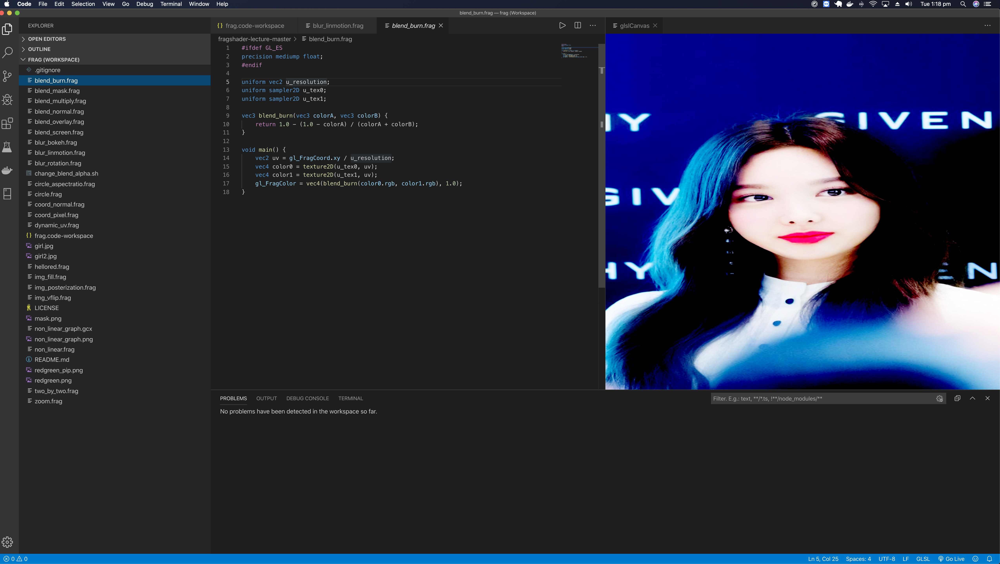

# Fragment shader lecture

Learn basics of fragment shader

## References
- [OpenGL ES 2.0 cheat sheet](https://www.khronos.org/opengles/sdk/docs/reference_cards/OpenGL-ES-2_0-Reference-card.pdf)
- [The book of shaders](https://thebookofshaders.com/)
- [Khronos GLES SL official doc](https://www.khronos.org/files/opengles_shading_language.pdf)

## Prerequisites
- Install [glslviewer](https://github.com/patriciogonzalezvivo/glslViewer)
- Install VScode
- Install Glsl-canvas [glsl-canvas](https://marketplace.visualstudio.com/items?itemName=circledev.glsl-canvas)


## VSCode config
Open the workspace frag.code-workspace 
update this file to change the channels/textures used by Glsl-canvas to render in viewer
	
	{
		"folders": [
			{
				"path": "."
			}
		],
		"settings": {
			"glsl-canvas.textures": {
				"0": "./girl.jpg",
				"2": "https://rawgit.com/actarian/plausible-brdf-shader/master/textures/noise/cloud-1.png",
				"1": "https://rawgit.com/actarian/plausible-brdf-shader/master/textures/noise/cloud-2.jpg",        
			}
		}
	}


## Hello world
Show red pixels

```glslviewer hellored.frag```

## Coordinates
Coordinates in pixel unit

```glslviewer coord_pixel.frag```

Normalized coordinates 

```glslviewer coord_normal.frag```

## Circle drawing
Draw a circle

```glslviewer circle.frag```

It looks like an ellipse if viewport size changes

```glslviewer circle.frag -w 300 -h 500```

## Aspect ratio

Draw a circle regardless of aspect ratio of viewport

```glslviewer circle_aspectratio.frag -w 300 -h 500```

## Texture drawing

Fill the viewport with an image ignoring aspect ratio. 
> Note: glslviewer makes u_tex[N] samplers automatically.

```glslviewer img_fill.frag girl.jpg```

## Texture from image file

Textures read from filesystem are vertically flipped. Followings are to simulate that with glslviewer.

```glslviewer img_fill.frag -vFlip girl.jpg```

Flip it vertically using fragment shader code

```glslviewer img_vflip.frag -vFlip girl.jpg```

## Color manipulation

Reduce color diversity

```glslviewer img_posterization.frag girl2.jpg```

## Blending colors

Blend two images

```glslviewer blend_normal.frag girl.jpg girl2.jpg```

and enter following command into glslviewer's command line

```u_blendAlpha,0.5```

Or, use automated one
> Note: glslviewer reads commands from stdin

```./change_blend_alpha.sh | glslviewer blend_normal.frag girl.jpg girl2.jpg```

## Photoshop blend mode

Blend two images with various blend mode
> Formula : https://docs.gimp.org/2.10/da/gimp-concepts-layer-modes.html

Multiply

```glslviewer blend_multiply.frag girl.jpg girl2.jpg```

Screen

```glslviewer blend_screen.frag girl.jpg girl2.jpg```

Overlay

```glslviewer blend_overlay.frag girl.jpg girl2.jpg```

Burn

```glslviewer blend_burn.frag girl.jpg girl2.jpg```


## Blur

Bokeh blur
> kernel of bokeh blur : https://youtu.be/vNG3ZAd8wCc?t=265

```glslviewer blur_bokeh.frag girl.jpg -w 300 -h 300```

Linear motion blur

```glslviewer blur_linmotion.frag girl.jpg -w 200 -h 200```

Rotational blur

```glslviewer blur_rotation.frag girl.jpg```

and enter following command into glslviewer's command line

```u_rotationDegree,10.0```


## Masking

Blend 2 images using mask image

```glslviewer blend_mask.frag girl.jpg girl2.jpg mask.png```

## Position manipulation

Zoom in

```glslviewer zoom.frag girl.jpg```

2x2 Composition

```glslviewer two_by_two.frag girl.jpg girl2.jpg```

Non-linear

```glslviewer non_linear.frag girl.jpg```


## Dynamic uv mapping

dynamic uv mapping with no effect

```glslviewer dynamic_uv.frag girl.jpg redgreen.png```

pip with dynamic uv mapping

```glslviewer dynamic_uv.frag girl.jpg redgreen_pip.png```


